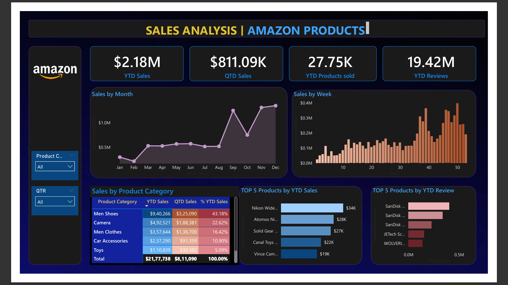

# Amazon Sales Dashboard

A Power BI sales analytics project designed to evaluate **sales performance, product demand and customer-review activity** across time and product categories.

## 🎯 Business Objective

Build an interactive reporting view that helps identify sales trends, high-performing products and changes in product/review activity over time.

## 📌 Key KPIs

- YTD Sales
- QTD Sales
- YTD Products Sold
- YTD Reviews

## 🔎 Analysis

- Sales by product category
- Product-level performance
- Product price analysis
- Monthly, quarterly and weekly trends
- Product reviews and activity
- Time-based performance comparison

## 🧩 Data Model

- **Amazon_Data** — primary sales/product dataset
- **Date Table** — time intelligence and period analysis

## 🛠️ Tools & Skills Demonstrated

- Power BI
- Data cleaning & transformation
- Data modeling
- Time-based analysis
- Interactive dashboard design
- Business reporting

## 💡 Business Value

The dashboard converts transactional/product data into an interactive management view, making it easier to monitor sales performance, compare products and identify trends requiring attention.

## 📷 Dashboard Preview

## 📂 Project File

[Open / download the Power BI file](Amazon-Sales-Dashboard.pbix)

> **Note:** DAX measures and detailed technical documentation will be expanded as the project portfolio develops.
