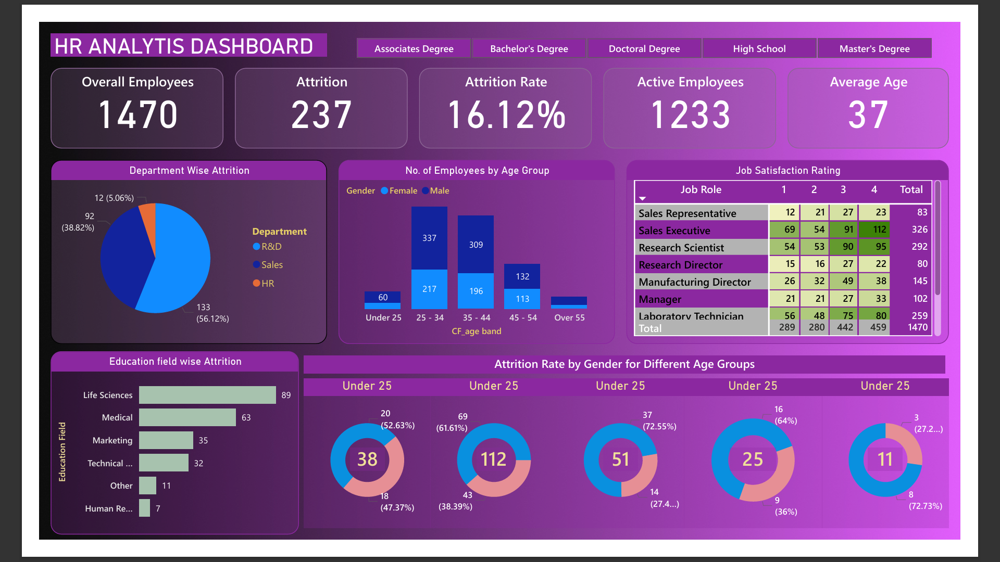

# HR Analytics Dashboard

A Power BI HR analytics project focused on **workforce composition, employee attrition and job satisfaction**.

## 🎯 Business Objective

Create an interactive HR reporting solution that helps identify workforce patterns, attrition levels and employee-satisfaction trends across key employee dimensions.

## 📌 Key KPIs

- Active Employees
- Employee Count
- Attrition Count
- Attrition Rate

## 🔎 Analysis

- Attrition by department
- Attrition by job role
- Age-band analysis
- Gender distribution
- Education and education-field analysis
- Job satisfaction
- Workforce composition

## 🧩 Data Model

- **Sheet1** — primary employee dataset

## 🛠️ Tools & Skills Demonstrated

- Power BI
- Data cleaning & transformation
- Data modeling
- HR analytics
- KPI development
- Interactive dashboard design
- Business reporting

## 💡 Business Value

The dashboard provides a structured view of workforce and attrition patterns so HR teams can identify areas with higher employee turnover and investigate potential workforce or satisfaction issues.

## 📷 Dashboard Preview

## 📂 Project File

[Open / download the Power BI file](HR-Analytics-Dashboard.pbix)

> **Note:** DAX measures and detailed technical documentation will be expanded as the project portfolio develops.
